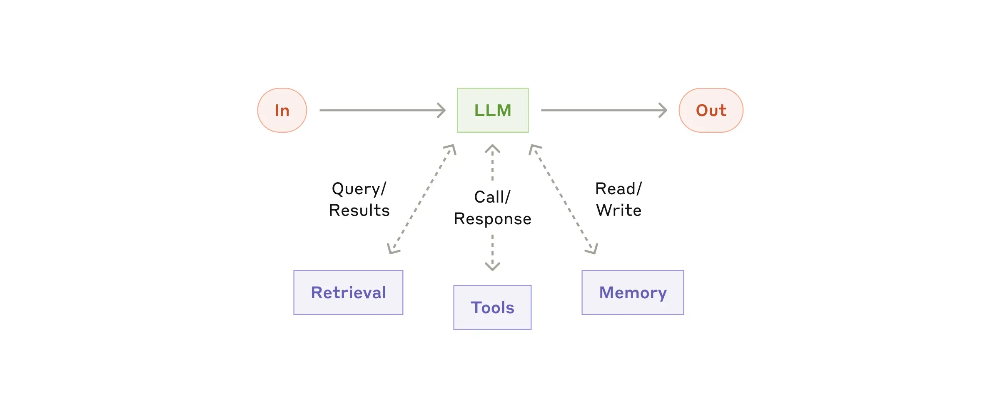
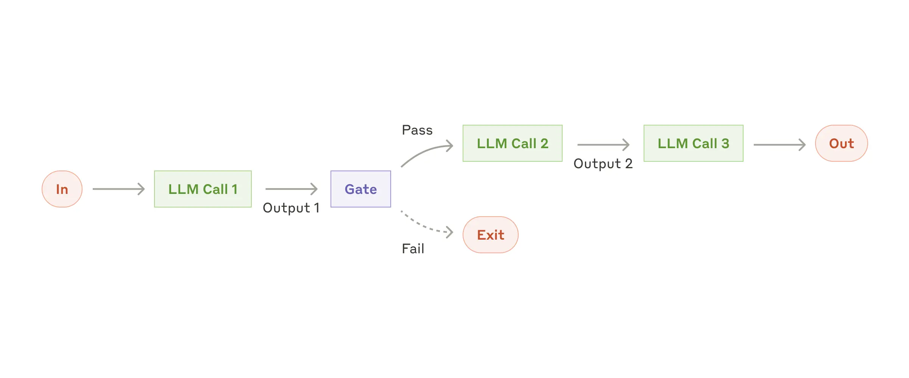
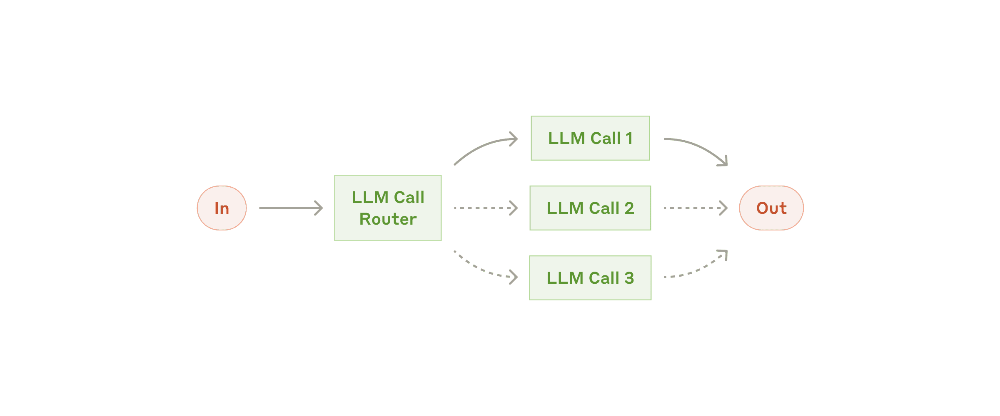
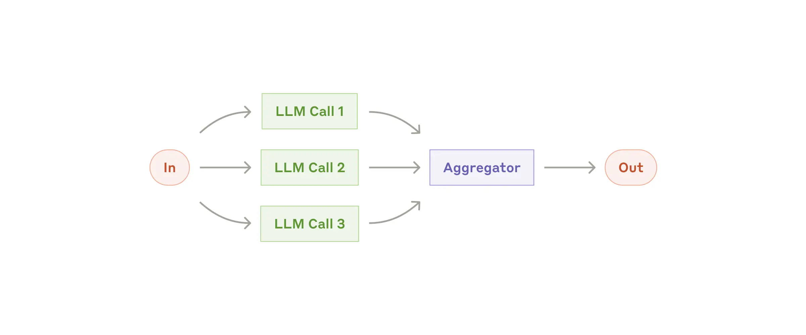

# What is agent?

This is widly discussed in the AI community, but we will settle with majority - "An LLM agent runs tools in a loop to achieve goals."

## Let digiest above statement in parts:

This is the pattern baked into many LLM APIs as tools or function calls - the LLM is given ability to request an actions to be executed by its
harness, and the outcome of those tools is fed back into the model so it can continue to reasn through and solve the given problem. 

"To achieve a goal" reflects that these are not infinite loops - there is a stopping condition.

If a technical implementer tells you - they are building an "agent", we are going to assume they mean they are wiring up tools to an LLM in order to achieve goals using those tools in a bounded loop.

# Building effective agents
*References taken from anthropic [website](https://www.anthropic.com/engineering/building-effective-agents)

## Building blocks, workflows and agents

1. Building blocks: the augmented LLM

The basic building blocks of agentic system is an LLM enhanced with augmentation such as retrieval, tools and memory. Our current models can activily use these capabilities

there are many ways on implementing these augmentations, one approach is using Model Context Protocol(MCP) which allows developer to integrate with a growing ecosystem of third party tools with simple client implementation.

## Workflow: Prompt chaining

Prompt chaining decomposes a task into a sequent steps, where each LLM call process the output of the previous one. You can add programmatic checks ("gates") on any intermediat steps to ensure process is still on track.

### When to use this workflow?

Ideal for situations where the task can be easily and cleanly deomposed into fixied subtassks. Main goal is to trade off latency for higher accurasy, by making each LLM call an easier task.

Example:
- Generating Marketing copy, then translating into a different language
- Writing an outline of a document, checking the outline meets certain criteria, then writing the document based on the outline.

## Workflow: Routing

Routing classifies an input and directs it to a specialized follow up task. This worklow allows for seperation of concenr and building more specialized prompts. Withouth this workflow, optimizing for one kind of input can hurt performance on other inputs.

### When to use this workflow?

- Routing works well for complex tasks where there are distinc categories that are better handled seperately, and where classification can be handled accurately, either by LLM or more traditional classification model/algo.

Examples:
- Directing different types of customer service queries(general questions, refund requests,technical support) into different downstram process, prompts and tools.
- Routing easy/common questions to smaller, cost effective modles Like Claude hike 4.5 etc 

## Workflow: Parallezation 

LLM can sometimes work stimultaneously on a task and have their outputs aggregated programmatically. This workflow manifest into two key variations:
- Sectioning: Breaking a task into independent subtask run in parallel
- Voting: Running the same task multiple times to give divers outputs

Examples where parallelization is useful:

- Sectioning:
Implementing guardrails where one model instance processes user queries while another screens them for inappropriate content or requests. This tends to perform better than having the same LLM call handle both guardrails and the core response.
Automating evals for evaluating LLM performance, where each LLM call evaluates a different aspect of the model’s performance on a given prompt.

- Voting:
Reviewing a piece of code for vulnerabilities, where several different prompts review and flag the code if they find a problem.
Evaluating whether a given piece of content is inappropriate, with multiple prompts evaluating different aspects or requiring different vote thresholds to balance false positives and negatives.

 To repeat: you should consider adding complexity only when it demonstrably improves outcomes.

### SUMMARY

Success in the LLM space isn't about building the most sophisticated system. It's about building the right system for your needs. Start with simple prompts, optimize them with comprehensive evaluation, and add multi-step agentic systems only when simpler solutions fall short.

When implementing agents, we try to follow three core principles:

1. Maintain simplicity in your agent's design.
2. Prioritize transparency by explicitly showing the agent’s planning steps.
3. Carefully craft your agent-computer interface (ACI) through thorough tool documentation and testing.

Frameworks can help you get started quickly, but don't hesitate to reduce abstraction layers and build with basic components as you move to production. By following these principles, you can create agents that are not only powerful but also reliable, maintainable, and trusted by their users.
